# Dama (Progetto PA)
Progetto del corso di Programmazione Avanzata a.a. 2022/2023

## Descrizione del progetto
Il progetto consiste nello sviluppo di sistema backend per la gestione del gioco della dama. Il sistema prevede la possibilità di far interagire due utenti (autenticati mediante JWT). Alla creazione si possono scegliere tre configurazioni di griglie (4x4, 6x6, 8x8) che corrispondono, rispettivamente, a tre diverse configurazioni iniziali di partenza. In particolare, si possono creare nuove partite, effettuare mosse, verificare tutte le info relative ad una partita, comprese di statistiche e di classifica e dello storico delle partite giocate. La creazione di una partita e la singola mossa hanno un costo in termini di token, rispettivamente 0.35 e 0.015.

## Funzioni del sistema

| Funzioni | Ruolo |
| -------- | ----- |
| Crea una nuova partita | User |
| Esegue una mossa | User |
| Mostra lo stato di una partita | User |
| Determina l'abbandono di una partita da parte di un utente | User |
| Mostra lo storico delle mosse di una data partita e ne permette l'esportazione su file | User |
| Mostra lo storico delle partite in un dato intervallo ordinate in base alla data e ne permette l'esportazione su file | User |
| Mostra lo storico delle partite ordinate in base al numero di mosse totali e ne permette l'esportazione su file | User |
| Mostra la classifica dei giocatori ordinata in base alle vittorie | General |
| Mostra il credito rimasto di un utente | User | 
| Mostra la lista degli utenti con credito residuo inferiore al valore scelto | Admin |
| Ricarica il credito di un utente | Admin |

Ogni funzione è associata ad una diversa richiesta HTTP (POST o GET), per alcune delle quali è prevista un'autenticazione tramite token JWT.

## Rotte 

| Tipo | Rotte |
| ---- | ----- |
| POST | /create-game |
| POST | /make-move |
| GET | /show-game |
| POST | /concede |
| GET | /game-log|
| GET | /games-per-date |
| GET | /games-per-moves |
| GET | /leaderboard |
| GET | /show-token |
| GET | /show-token-admin |
| POST | /refill |

## Progettazione

### Use Case Diagram


### Interaction Overview Diagram


## Crea una nuova partita (/create-game)
Mediante l'utilizzo di questa rotta si può creare una nuova partita. Questa rotta può essere richiamata solamente dagli utenti autenticati.
L'utente autenticato con JWT può iniziare una partita specificando il nome del player 2 e la dimensione del lato della damiera tra le seguenti configurazioni: 4, 6 o 8. Il nome del giocatore che crea la partita (il player 1) è preso implicitamente dal bearer token. E' possibile creare una nuova partita solo se entrambi i giocatori sono disoponibili, ovvero non poso impegnati in altre partite. 
Alla creazione del gioco vengono sottratti 0,35 crediti al giocatore che crea il gioco.

Da effettuare tramite token JWT che deve contenere un payload JSON con la seguente struttura:
~~~
{
    "player2": "player1@gmail.com",
    "dimensione": 4
}
~~~

### Sequence Diagram di /create-game

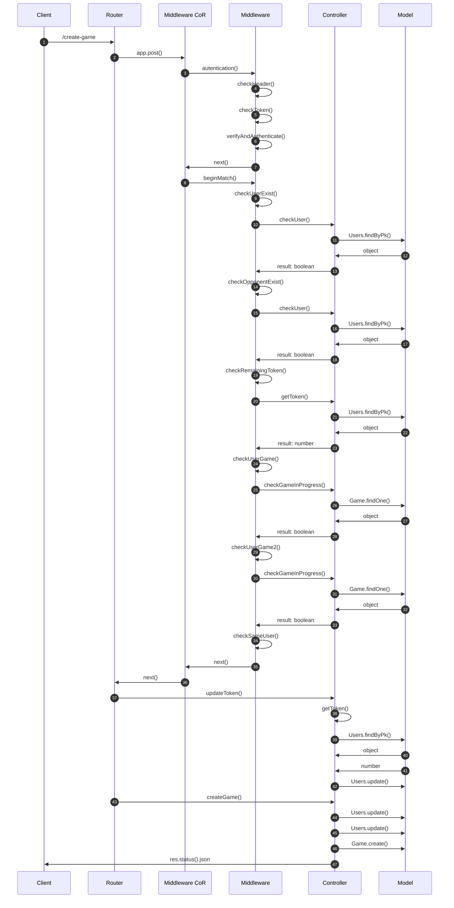

## Esegui una mossa (/make-move)
Mediante l'utilizzo di questa rotta si può effettuare una mossa. Questa rotta può essere richiamata solamente dagli utenti autenticati che partecipano a quella partita.
L'utente autenticato tramite JWT, a partire dall'id del gioco e dalle coordinate iniziali (da_x e da_y), sceglie in quale casella muoversi (a_x e a_y). Sono ammessi solo movimenti in diagonale di una casella e all'interno della dimensione del campo da gioco. I pedoni possono muoversi solo in avanti: i neri per x crescenti e i bianchi per x decrescenti. Il sistema prevede che quando un pedone arriva al lato opposto diventi dama e che potrà quindi muoversi anche all'indietro. La partita termina quando uno dei due giocatori si arrende (/concede) oppure finisce i suoi pezzi.
A ogni mossa vengono sottratti 0,015 crediti all'utente che effettua il turno.

Le assunzioni fatte sono: 
- il player 1 ha sempre i pezzi neri e inizia per primo;
- i pezzi si muovono sempre e solo nella casella diagonale adiacente;
- quando un pezzo avversario viene catturato, il pedone che lo mangia si posiziona al suo posto;
- a ogni mossa andata a buon fine il turno passa automaticamente all'avversario.

### Esempio Damiera 4x4:


La rotta si deve effettuare tramite token JWT che deve contenere un payload JSON con la seguente struttura:
~~~
{
    "id_game": 1,
    "da_x":0,
    "da_y":0,
    "a_x":1,
    "a_y":1
}
~~~

### Sequence Diagram di /make-move

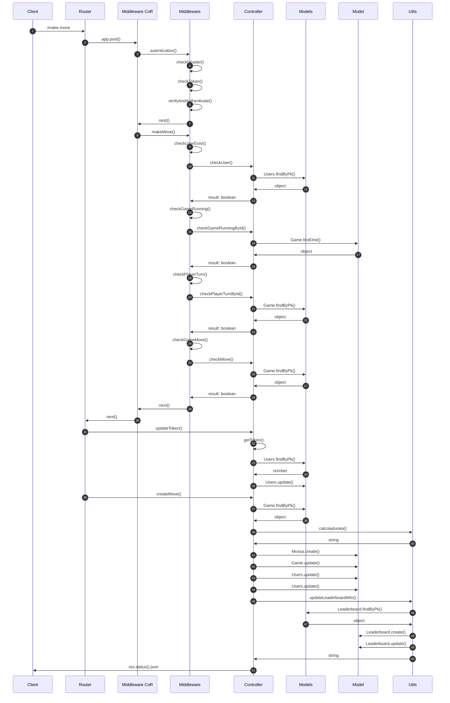

## Mostra lo stato di una partita (/show-game) 
Mediante l'utilizzo di questa rotta si può vedere lo stato di una partita.
L'utente autenticato tramite JWT può vedere lo stato di una partita semplicemente inserendo l'id della partita in corso o terminata.

Il payload JSON deve avere la seguente struttura:
~~~
{
    "id_game": 1
}
~~~

### Sequence Diagram di /show-game

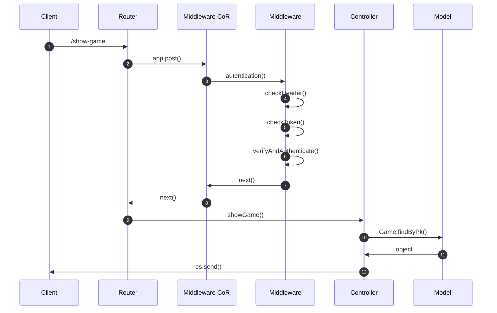

## Datermina l'abbandono di una partita da parte di un utente (/concede) 
Mediante questa rotta si va a determinare l'abbandono di una partita, dato il suo id univoco, da parte di un utente. Si aggiornano i campi dei modelli Game (stato della partita), Leaderboard (statistiche dei giocatori) e Users (gli utenti ritornano disponibili per altre partite). Può essere chiamata solo da utenti autenticati tramite JWT.

Da effettuare tramite token JWT che deve contenere un payload JSON con la seguente struttura:
~~~
{
    "id_game":1
}
~~~

### Sequence Diagram di /concede

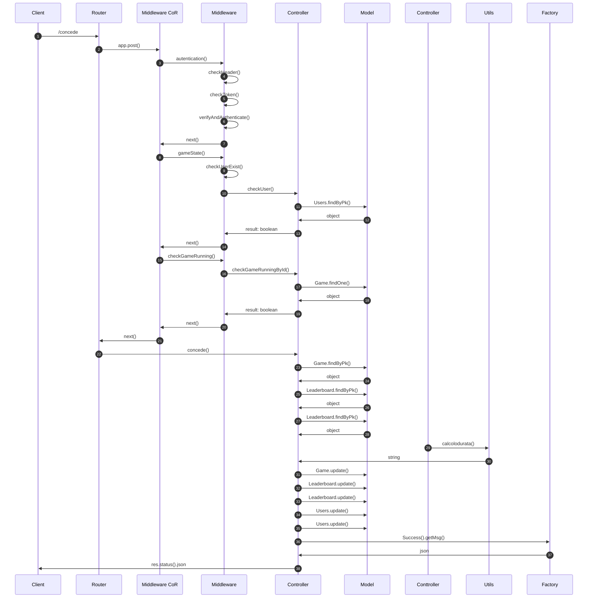
## Mostra lo storico delle mosse di una data partita e ne permette l'esportazione su file (/game-log)
Mediante l'utilizzo di questa rotta si può vedere lo storico delle mosse di una partita e salvarlo nel path specificato, in formato JSON, CSV o PDF. Questa rotta può essere richiamata solamente dagli utenti autenticati tramite JWT selezionando, quindi, l'id del gioco, il path e il formato desiderati (in maiuscolo o minuscolo). Il path fa riferimento all'immagine di Node creata da Docker.

Da effettuare tramite token JWT che deve contenere un payload JSON con la seguente struttura:
~~~
{
    "id_game":1, 
    "path": "/usr/src/app",
    "format": "JSON"
}
~~~

### Sequence Diagram di /game-log

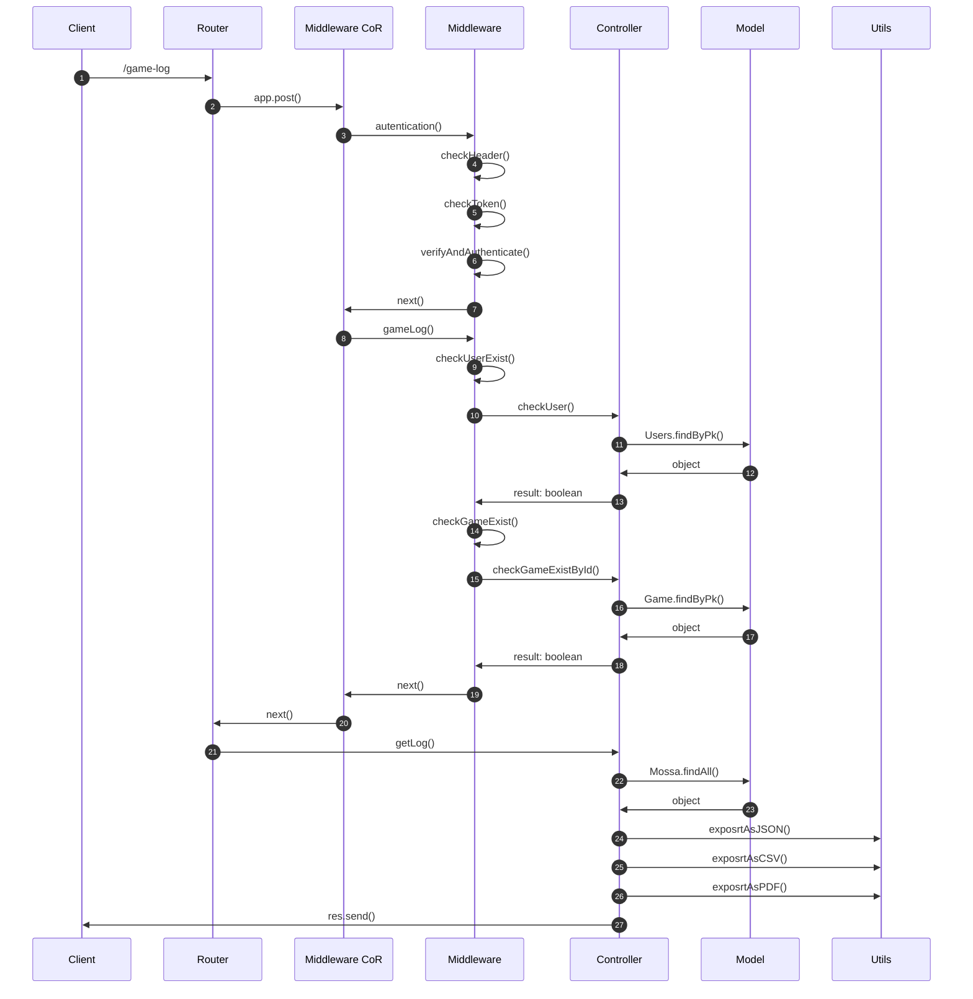

## Mostra lo storico delle partite in un dato intervallo e ne permette l'esportazione su file (/games-per-date)
Mediante l'utilizzo di questa rotta si può vedere lo storico delle mosse di un giocatore tra la data finale e iniziale specificate. Permette anche l'ordinamente in ordine crescente (asc) o decrescente (desc) in base alla date e l'esportazione nei formati JSON, CSV o PDF Questa rotta può essere richiamata solamente dagli utenti autenticati tramite JWT.

Da effettuare tramite token JWT che deve contenere un payload JSON con la seguente struttura:
~~~
{
    "email": "player1@gmail.com",
    "date_start": "2023-06-01",
    "date_end": "2023-07-01", 
    "sort": "asc",
    "path": "/usr/src/app",
    "format": "CSV"
}
~~~

### Sequence Diagram di /games-per-date
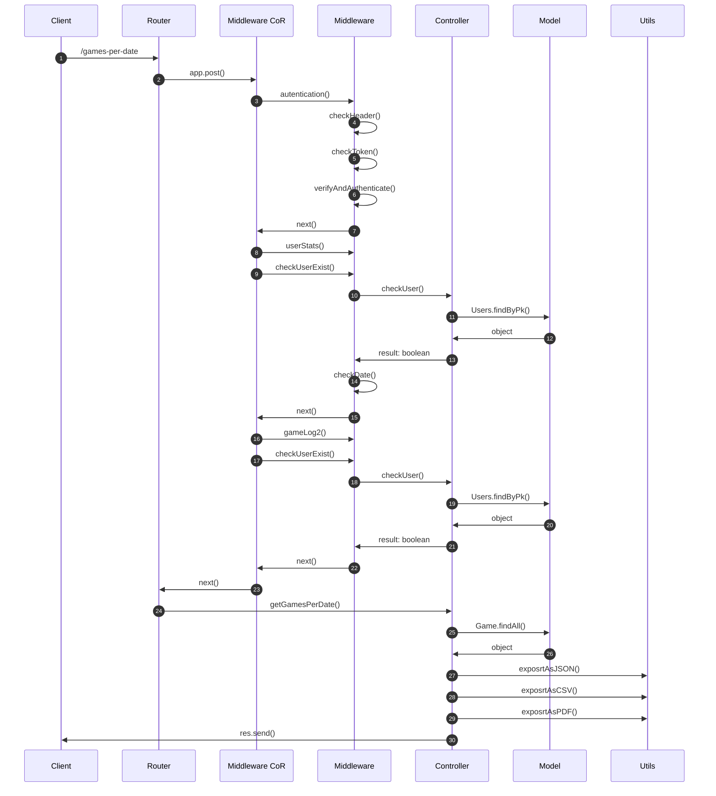

## Mostra lo storico delle partite ordinate in base al numero di mosse totali e ne permette l'esportazione su file (/games-per-moves)
Mediante l'utilizzo di questa rotta si può vedere lo storico delle mosse di un giocatore ordinate in ordine crescente (asc) o decrescente (desc) in base al numero di mosse totali. Ne permette anche l'esportazione nei formati JSON, CSV o PDF Questa rotta può essere richiamata solamente dagli utenti autenticati tramite JWT.

Da effettuare tramite token JWT che deve contenere un payload JSON con la seguente struttura:
~~~
{
    "email": "player1@gmail.com",
    "sort": "asc",
    "path": "/usr/src/app",
    "format": "CSV"
}
~~~

### Sequence Diagram di /games-per-moves
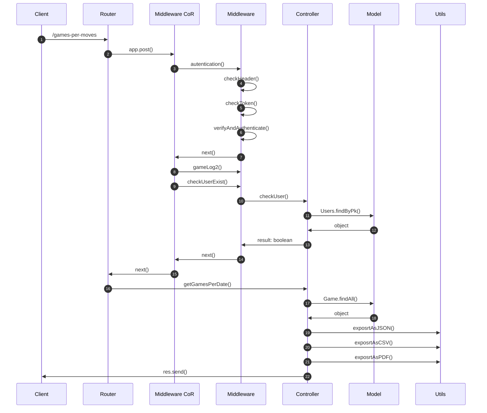

## Mostra la classifica dei giocatori ordinata (/leaderboard)
Mediante l'utilizzo di questa rotta si può vedere la classifica ordinata in modo crescente o descrescente in base al numero di vittorie (non di default). Questa rotta è pubblica.

Da effettuare con un payload JSON con la seguente struttura:
* Classifica decrescente
~~~
{
    "sort": "desc"
}
~~~
* Classifica crescente
~~~
{
    "sort": "asc"
}
~~~

### Sequence Diagram di /leaderboard

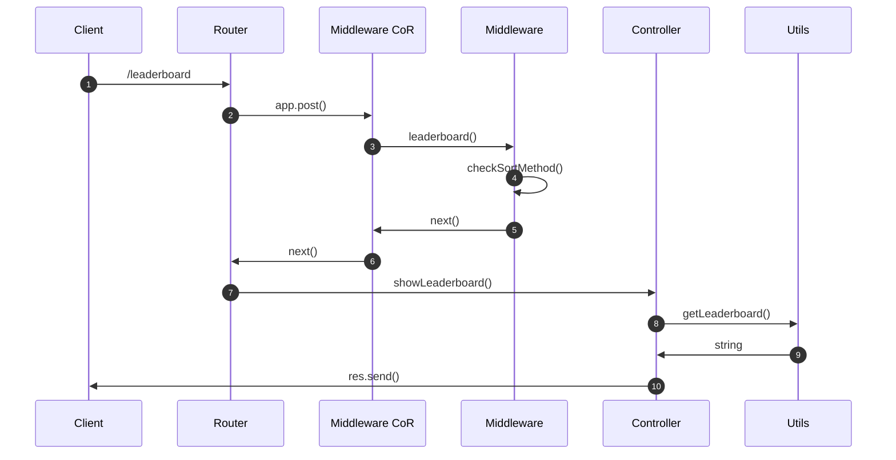

## Mostra credito di un utente (/show-token)
Mediante l'utilizzo di questa rotta si può visualizzare il proprio credito. Questa rotta può essere richiamata dagli utenti autenticati tramite JWT.
Non prevede un body nelle richieste.

### Sequence Diagram di /show-token

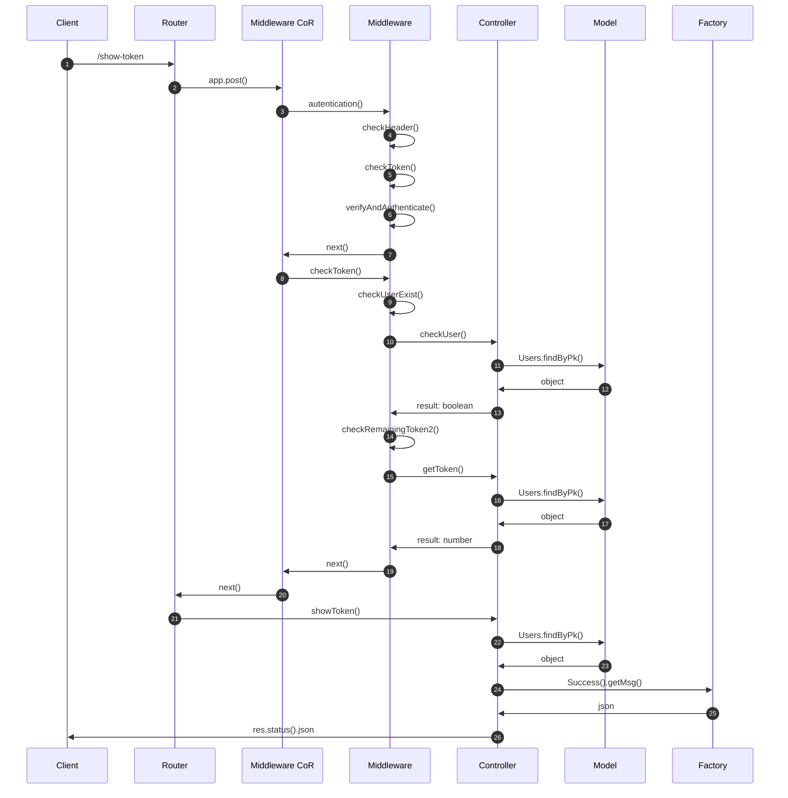
 
## Mostra credito di un utente (/show-token-admin)
Mediante l'utilizzo di questa rotta si mostra la lista degli utenti con credito residuo inferiore al valore scelto. Questa rotta può essere richiamata dagll'utente autenticato con ruolo di admin.

Da effettuare tramite token JWT che deve contenere un payload JSON con la seguente struttura:
~~~
{
    "token": 10.000
}
~~~


### Sequence Diagram di /show-token-admin

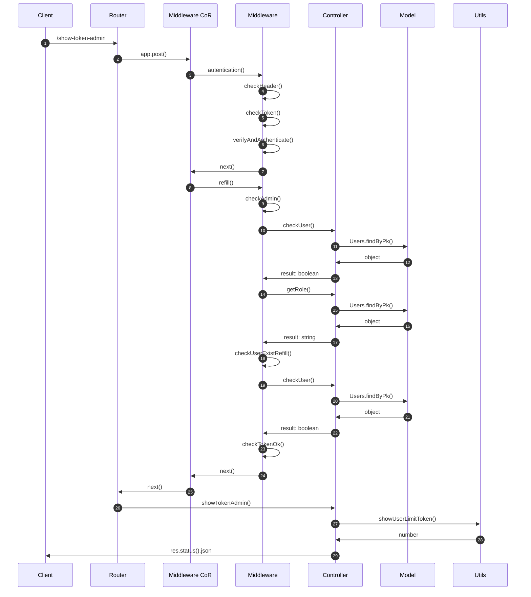

## Ricarica il credito di un utente (/refill)
Mediante l'utilizzo di questa rotta si può impostare il credito di un utente. Questa rotta può essere richiamata solamente dagli utenti autenticati, con ruolo admin.

Da effettuare tramite token JWT che deve contenere un payload JSON con la seguente struttura:
~~~
{
    "email": "user2@mail.it",
    "token": 50
}
~~~

### Sequence Diagram di /refill

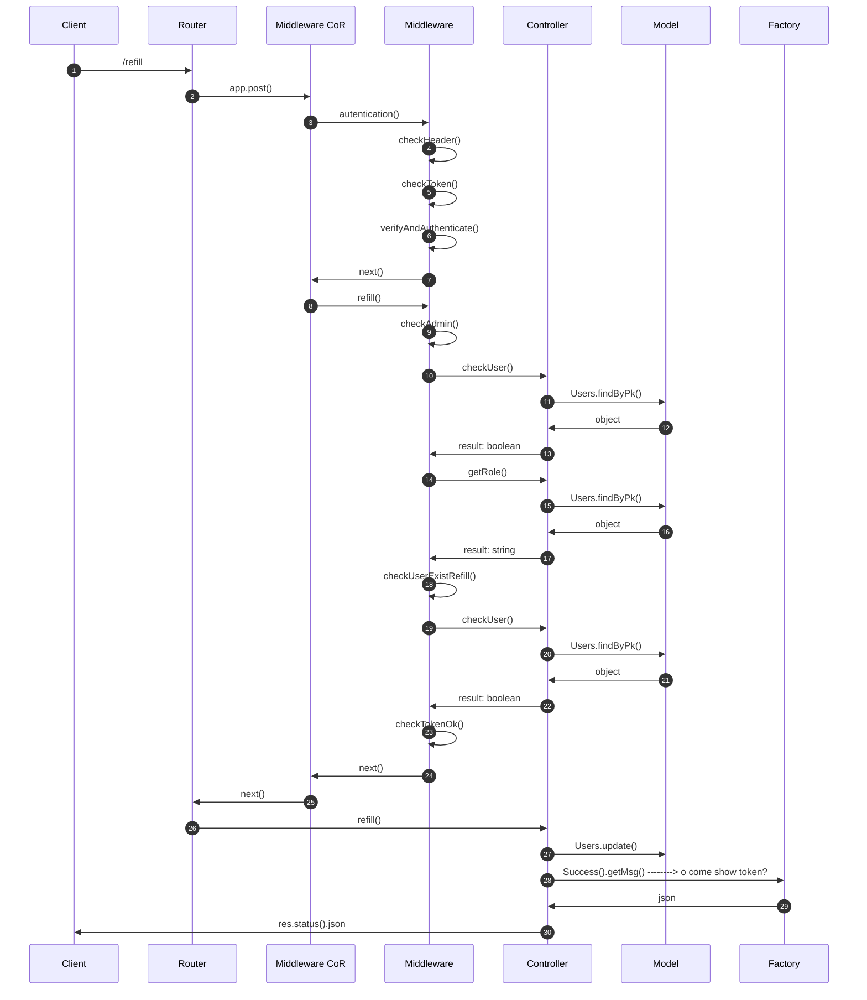

## Pattern utilizzati

### Factory Method:
Il **factory method** è un pattern di progettazione creazionale che fornisce un’interfaccia per la creazione di oggetti in una superclasse, ma consente alle sottoclassi di modificare il tipo di oggetti che verranno creati.
Abbiamo implementato questo pattern per la gestione degli errori: in caso di errore rimandiamo a una funzione generica di errore, che a sua volta rimanda all'errore specifico.

### Singleton
Il **singleton** è un design pattern creazionale che ha lo scopo di garantire che di una determinata classe venga creata una e una sola istanza, e di fornire un punto di accesso globale a tale istanza.
Nel nostro contesto viene uusato per creare una sola istanza di connessione al database.

### Chain Of Responsibility
La **catena di responsabilità** è un pattern comportamentale che consente di passare le richieste lungo una catena di gestori. Alla ricezione di una richiesta, ciascun handler decide di elaborare la richiesta o di passarla al successivo handler della catena.  
Nel nostro caso è utilizzato per controllare le richieste passandone la verifica tra diversi middleware, ognuno dei quali è specializzato in un controllo differente.

## Avviare il progetto:
Il progetto può essere avviato usando **Docker**.

Steps:
1. Clonare repository;
2. Posizionarsi nella directory del repository appena clonato;
3. Digitare ```docker compose up```;
4. Il programma è in esecuzione nel container docker.

## Testing
Si può testare il progetto eseguendo una serie di test predefiniti, importando all'interno di Postman la collection presente nella cartella **dama.postman_collections** all'interno di questo repository.   
I token **JWT**, sono stati generati, utilizzando JWT.IO, tramite la chiave ```secretkey``` con l'algoritmo HS384.

## Autori
#### Giannelli Edoardo
#### Maccarone Ciro
