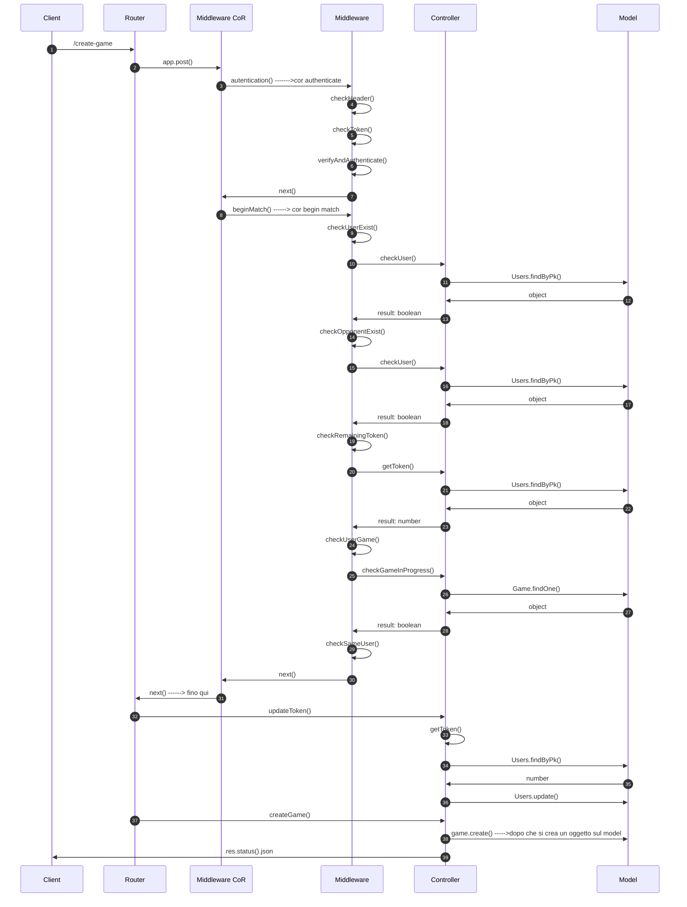
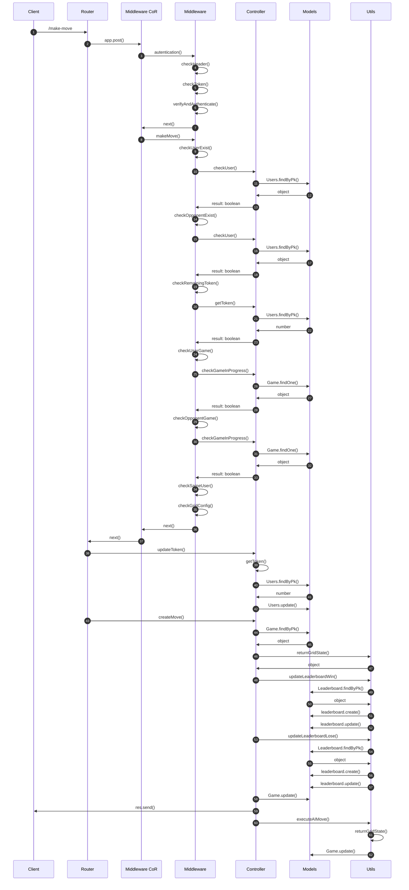
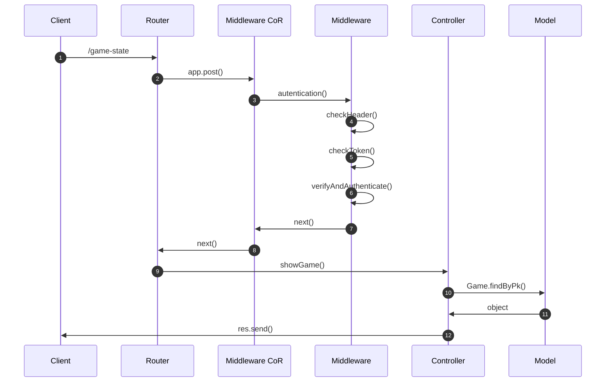
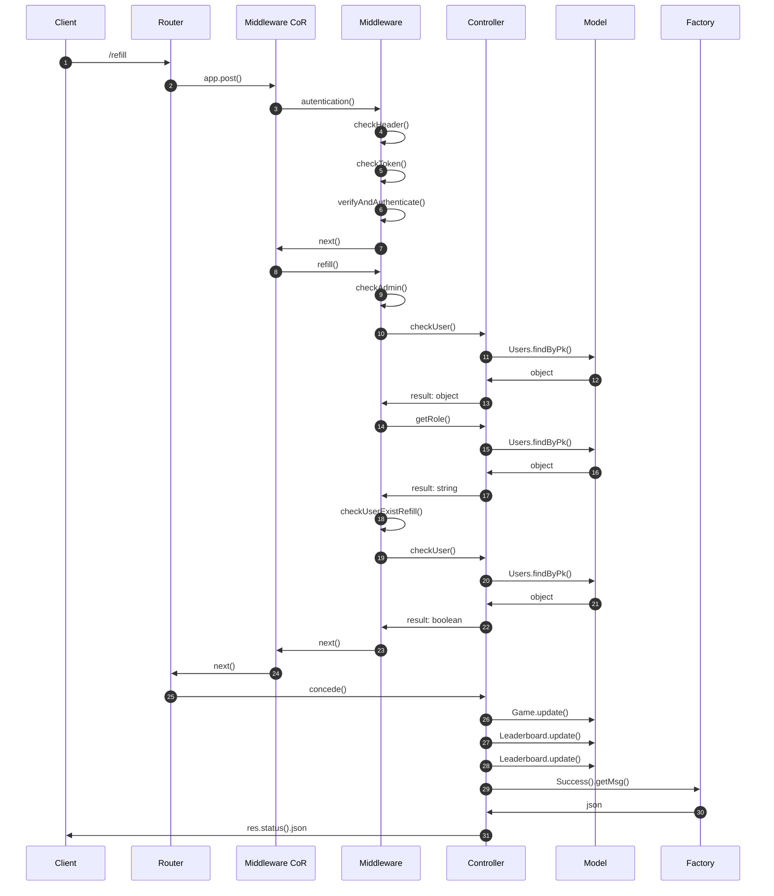
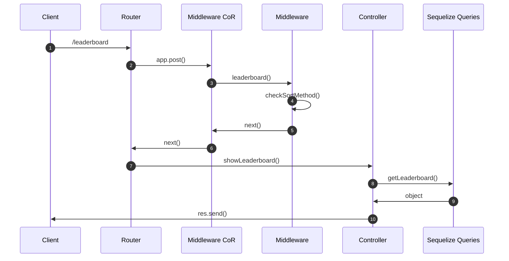
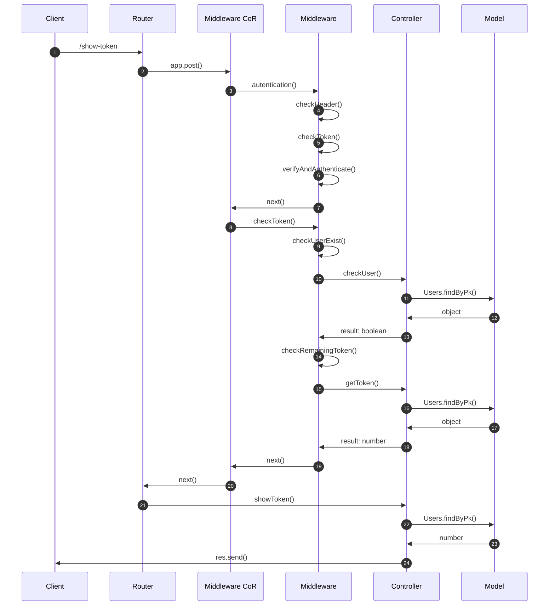
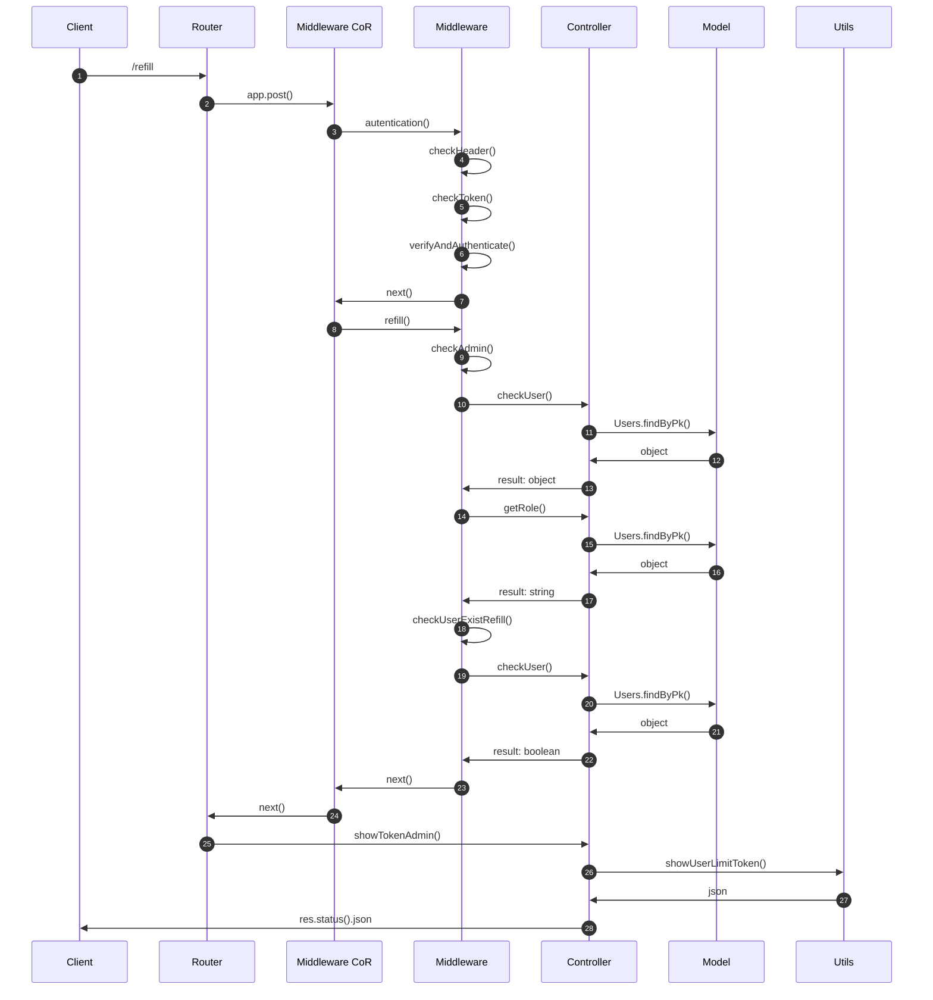
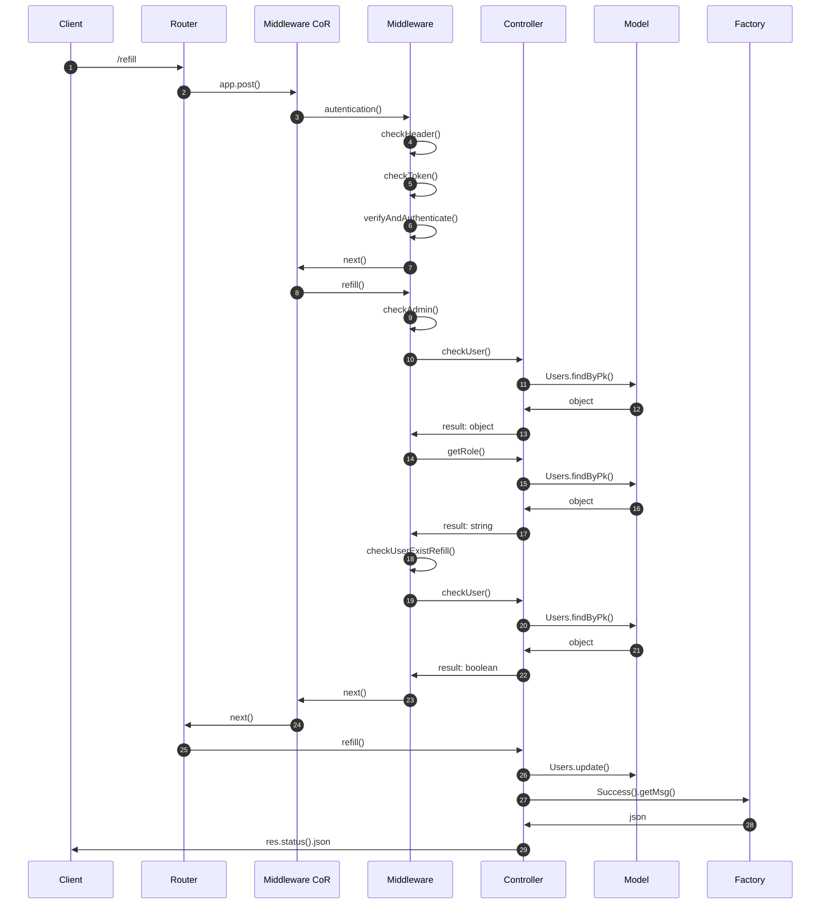

# Dama (Progetto PA)
Progetto del corso di Programmazione Avanzata

## Descrizione del progetto
Il progetto consiste nello sviluppo di sistema backend per la gestione del gioco della dama. Il sistema prevede sia la possibilità di far interagire due utenti (autenticati mediante JWT) sia la possibilità che più partite siano attive nello stesso momento. Alla creazione si possono scegliere tre configurazioni di griglie (4x4, 6x6, 8x8) che corrispondono, rispettivamente, a tre diverse configurazioni iniziali di partenza. In particolare, si possono creare nuove partite, effettuare mosse, verificare tutte le info relative ad una partita, comprese di statistiche e di classifica e dello storico delle partite giocate. La creazione di una partita e la singola mossa hanno un costo in termini di token, rispettivamente 0.35 e 0.015.

## Funzioni del sistema

| Funzioni | Ruolo | -----?ruoli + aggiorna da chi posso essere richiamate prendendo in input cosa + aggiorna postman nelle descrizioni
| -------- | ----- |
| Crea una nuova partita | User |
| Esegue una mossa | User |
| Mostra lo stato di una partita | User |
| Determina l'abbandono di una partita da parte di un utente | User |
| Mostra lo storico delle mosse di una data partita | User |
| Mostra lo storico delle partite | User |
| Mostra la classifica dei giocatori ordinata | General |
| Mostra il credito rimasto di un utente | User | 
| Mostra la lista degli utenti con credito residuo inferiore al valore scelto | General |
| Ricarica il credito di un utente | Admin |

Ogni funzione è associata ad una diversa richiesta HTTP (POST o GET), per alcune delle quali è prevista un'autenticazione tramite token JWT.

## Rotte ------>aggiorna

| Tipo | Rotte |
| ---- | ----- |
| POST | /create-game |
| GET | /make-move |
| GET | /show-game |
| GET | /concede |
| GET | / |
| GET | / |
| POST | /leaderboard |
| POST | /show-token |
| POST | /show-token-admin |
| POST | /refill |

## Progettazione

### Use Case Diagram


### Interaction Overview Diagram


## Crea una nuova partita (/create-game)
Mediante l'utilizzo di questa rotta si può creare una nuova partita. Questa rotta può essere richiamata solamente dagli utenti autenticati.
L'utente autenticato con JWT può iniziare una partita specificando il nome del player 2 e la dimensione della griglia tra le seguenti configurazioni: 4x4, 6x6, 8x8.

Da effettuare tramite token JWT che deve contenere un payload JSON con la seguente struttura:
~~~
{
    "player2": "player1@gmail.com",
    "dimensione": 3
}
~~~

### Sequence Diagram di /create-game ----> modifica



## Esegui una mossa (/make-move) ---------->aggiorna
Mediante l'utilizzo di questa rotta si può effettuare una mossa. Questa rotta può essere richiamata solamente dagli utenti autenticati. 
L'utente autenticato tramite JWT deve semplicemente scegliere una riga (row) e una colonna (col) che saranno le due coordinate della cella in cui sparerà. Le coordinate devono essere tra 0 e la dimensione della griglia - 1. L'id univoco della partita dovrà essere lo stesso della partita che sta giocando quell'utente.

La rotta si deve effettuare tramite token JWT che deve contenere un payload JSON con la seguente struttura:
~~~
{
    "id": 10,
    "move": {
        "player": "player1@gmail.com",
        "row": 1,
        "col": 0
    }
}
~~~

### Sequence Diagram di /make-move



## Mostra lo stato di una partita (/show-game) 
Mediante l'utilizzo di questa rotta si può vedere lo stato di una partita.
L'utente autenticato tramite JWT può vedere lo stato di una partita semplicemente inserendo l'id della partita in corso o terminata. Questa rotta può essere richiamata solamente dagli utenti autenticati.

Il payload JSON deve avere la seguente struttura:
~~~
{
    "id_game": 2
}
~~~

### Sequence Diagram di /show-game



## Datermina l'abbandono di una partita da parte di un utente (/concede) ---->aggiorna
Mediante questa rotta si va a determinare l'abbandono di una partita da parte di un utente aggiornando i campi del modello Game relativi all'abbandono del giocatore, al vincitore e allo stato del gioco e aggiorna la leaderboard di entrambi i giocatori.

Da effettuare tramite token JWT che deve contenere un payload JSON con la seguente struttura:
~~~
{

}
~~~

### Sequence Diagram di /concede



## Mostra la classifica dei giocatori ordinata (/leaderboard)
Mediante l'utilizzo di questa rotta si può vedere la classifica ordinata in modo crescente o descrescente. Questa rotta è pubblica.

Da effettuare con un payload JSON con la seguente struttura:
* Classifica decrescente
~~~
{
    "sort": "desc"
}
~~~
* Classifica crescente
~~~
{
    "sort": "asc"
}
~~~

### Sequence Diagram di /leaderboard



## Mostra credito di un utente (/show-token)
Mediante l'utilizzo di questa rotta si può visualizzare il proprio credito. Questa rotta può essere richiamata dagli utenti autenticati.

Da effettuare tramite token JWT

### Sequence Diagram di /show-token


 
## Mostra credito di un utente (/show-token-admin)
Mediante l'utilizzo di questa rotta si mostra la lista degli utenti con credito residuo inferiore al valore scelto. Questa rotta può essere richiamata dagli utenti autenticati, cocn ruolo admin.

Da effettuare tramite token JWT

### Sequence Diagram di /show-token-admin



## Ricarica il credito di un utente (/refill)
Mediante l'utilizzo di questa rotta si può settare il credito di un utente. Questa rotta può essere richiamata solamente dagli utenti autenticati, con ruolo admin.

Da effettuare tramite token JWT che deve contenere un payload JSON con la seguente struttura:
~~~
{
    "email": "user2@mail.it",
    "token": 50
}
~~~

### Sequence Diagram di /refill



## Pattern utilizzati

### Factory Method:
Il **factory method** è un pattern di progettazione creazionale che fornisce un’interfaccia per la creazione di oggetti in una superclasse, ma consente alle sottoclassi di modificare il tipo di oggetti che verranno creati.  
Nel nostro progetto abbiamo utilizzato questo pattern per generare diverse classi di errori e messaggi di stato in base alle esigenze.  
Il pattern permette, dunque, di rimpiazzare la creazione diretta degli oggetti delle classi di interesse con una più generica chiamata al factory method. Il factory method instanzierà l'oggetto corretto in base all'argomento che riceverà in input. Il vantaggio principale consiste nel poter fare l'override del factory method nelle sotto-classi in modo da specializzarne il comportamento.

### Singleton
Il **singleton** è un design pattern creazionale che ha lo scopo di garantire che di una determinata classe venga creata una e una sola istanza, e di fornire un punto di accesso globale a tale istanza.  
L'uso più comune di tale pattern è quando si vuole garantire e, allo stesso tempo, controllare l'accesso ad una risorsa condivisa, come ad esempio una connessione oppure un file. 
Nel nostro progetto viene utilizzato per generare la connesione al database. Difatti, non appena una porzione di codice vorrà accedere al database, verrà istanziato il singleton. Tuttavia, non appena succesive chiamate tenteranno di accedere nuovamente al database, invece che instanziare una nuova connessione verrà resituita al chiamante l'istanza del singleton già creata. Ciò permette di rispamiare risorse computazionali, dato che mantenere attive delle connessioni inutilmente è "costoso".

### Chain Of Responsibility
La **catena di responsabilità** è un pattern comportamentale che consente di passare le richieste lungo una catena di gestori. Alla ricezione di una richiesta, ciascun handler decide di elaborare la richiesta o di passarla al successivo handler della catena.  
È molto simile ad un decoratore ma a differenza di quest’ultimo, la catena di responsabilità può essere interrotta.  
La Catena di Responsabilità è formata da degli handler (funzioni o metodi), che hanno lo scopo di verificare se quello che gli viene passato soddisfa o meno dei criteri. Se il criterio è soddisfatto, non si ritorna, come avveniva nel Proxy, ma si va avanti passando il controllo all’handler successivo.  
Le funzioni middleware sono funzioni che hanno accesso all'oggetto richiesta (req), all'oggetto risposta (res) e alla successiva funzione middleware nel ciclo richiesta-risposta dell'applicazione. La funzione middleware successiva è comunemente indicata da una variabile denominata next.  
Nel progetto utilizziamo la catena di responsabilità insieme al middleware per verificare che per ciascuna delle operazioni che si vogliono compiere siano rispettati tutti i requisiti, se così non fosse il middleware che non viene rispettato segnalerà l'errore opportuno.

## Avviare il progetto:
Il progetto può essere avviato usando **Docker**.

Steps:
1. Clonare repository
2. Posizionarsi nella directory del repository appena clonato
3. Digitare ```docker compose up```
4. Il programma è in esecuzione nel container docker.

## Testing
Si può testare il progetto eseguendo una serie di test predefiniti, per fare ciò occorre importare all'interno di Postman le due collection presenti nella cartella **postman_collections** all'interno di questo repository.   
I token **JWT**, sono stati generati, utilizzando JWT.IO, tramite la chiave ```secretkey```.  

## Autori
#### Giannelli Edoardo
#### Maccarone Ciro
